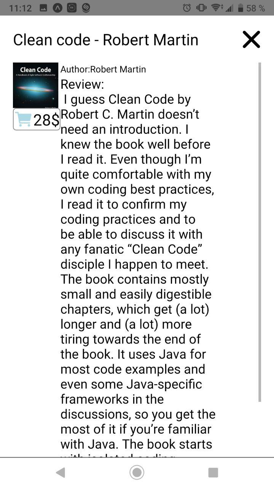

# lab 4 mobile app by Fedortsev IO-81

check my variant `(8127 % 2 + 1)` = 2

## add ney valey to book list

add author and review

## create Modal

after click to button with book Modal is open and you can see screen with more information about book with navigation button to go back

oppening and closing modal occurs using the useState with parameter modalVisible, which can be changed by setModalVisible

`const [modalVisible, setModalVisible] = useState(false)`

button -> `onPress={() => setModalVisible(true)}`

example:

## create search bar

create element `<TextInput>` with parameter `onChangeText` and give it valey (text) - our input. This parameter will read text every change and resolve FlatList using property renderItem

example of output:

## create gitignore, commit and push to git
