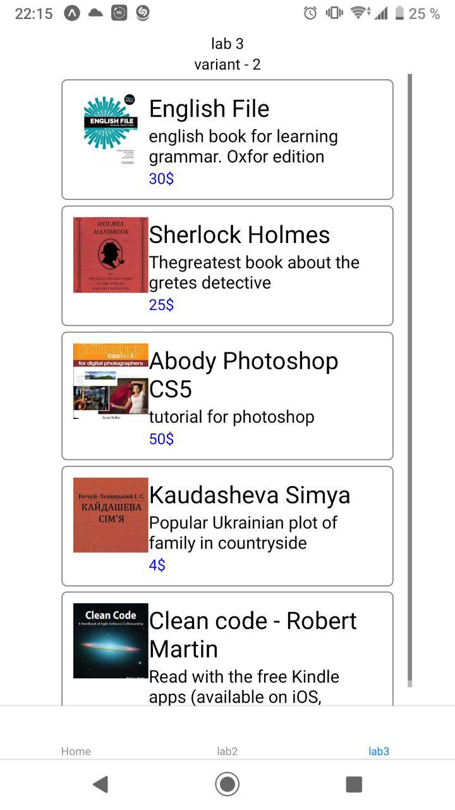

# lab 3 mobile app by Fedortsev IO-81

check my variant `(8127 % 2 + 1)` = 2

## create component Books and list of books inside

create keys img, title, text and price

<!-- in react native we can not use img source as variable dynamically, so I i chose another way - create value with will be key for another component with images -->

> {
> img: '1',
>
> title: 'English File',
>
> text: 'english book for learning grammar. Oxfor edition',
>
> price: '30$',
> },
> ...

## create ScrollView with FlatList inside

use FlatList and Item with `data={Books}` inside to render list of books

example of output:

## create gitignore, commit and push to git
