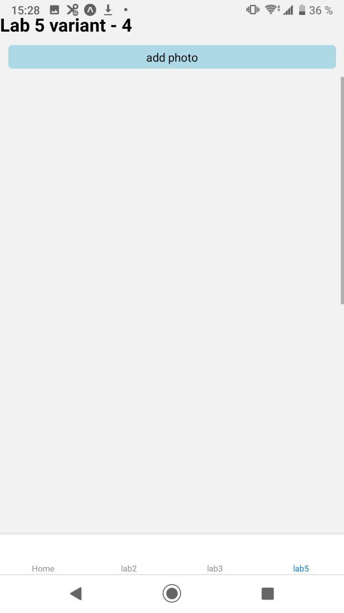
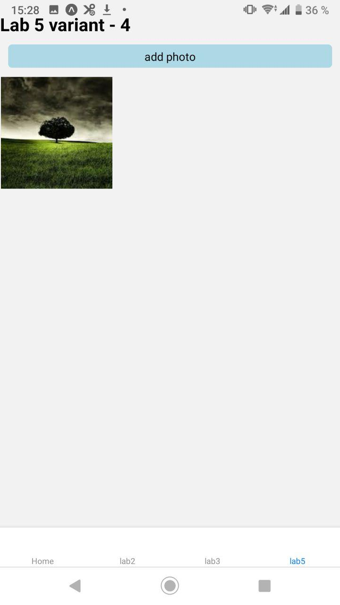

# lab 4 mobile app by Fedortsev IO-81

check my variant `(8127 % 6 + 1)` = 4

# creating grid

I was using `react-native-easy-grid` for this laboratory. Just playd with Col and Row and build view which I have on my variant

# Add photos

use `expo-image-picker` for get images from my phone's galary, which called after button 'add photo' press, use `useState` to get path for this photo and simple `Array` to store them

Each `Image` element has own image path `Array[i]`

After a choose photo, it fill in its place in grid

#examples

empty screen

window of choosing photo from my galary

photo appears

I had some problems with adding a video to Readme

## create gitignore, commit and push to git
