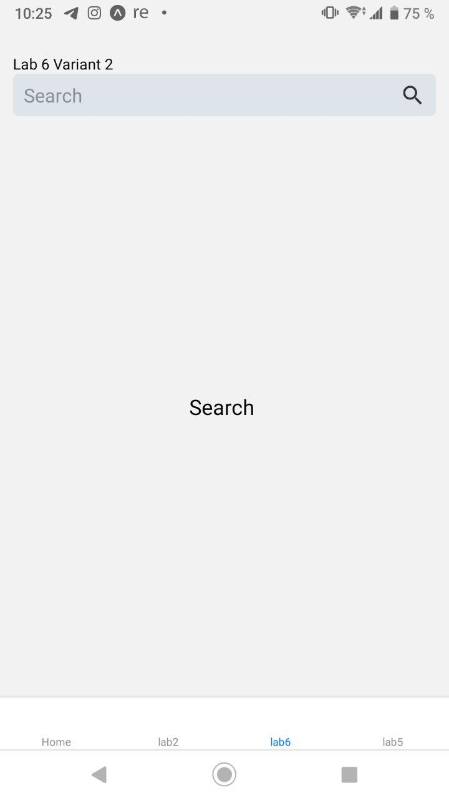
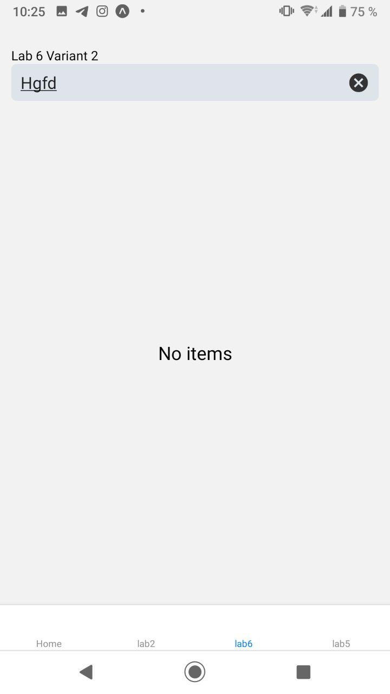
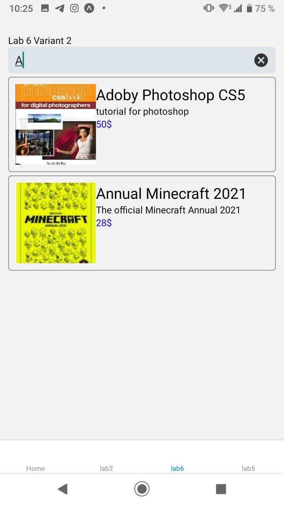

# lab 6 mobile app by Fedortsev IO-81

check my variant `(8127 % 2 + 1)` = 2

# Filter items

Use inner method `filter`

#examples

empty screen

window after wrong input

window after finding item

I had some problems with adding a video to Readme

## create gitignore, commit and push to git
