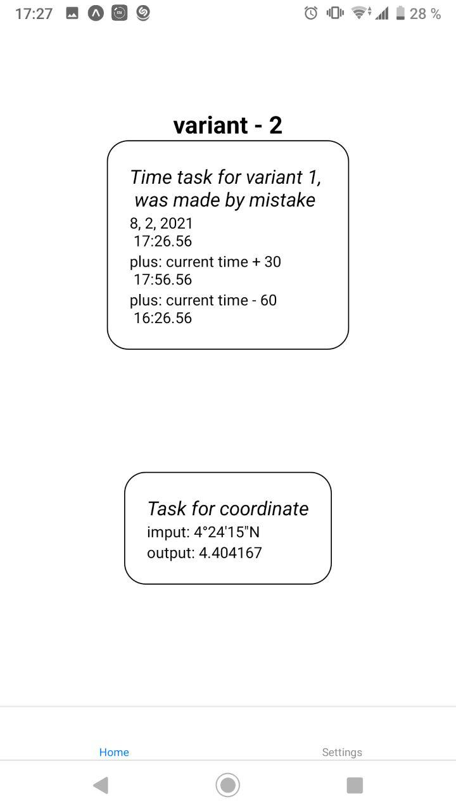

# lab 1.2 mobile app by Fedortsev IO-81

check my variant `(8127 / 2 + 1) & 1 ? 1 : 2` = 2

## create parameters degree, minutes, seconds and path (N/S/W/E)

which values fill in their diapasons

## create script to translate to another coordinate sistem

> longsec = (sec / 60) \* 100
>
> longmin = (min + longsec / 100) / 60
>
> long = degrees + longmin
>
> long = long.toFixed(6)`

## create element to output this parameters

create element `<Text>`

## create gitignore, commit and push to git
