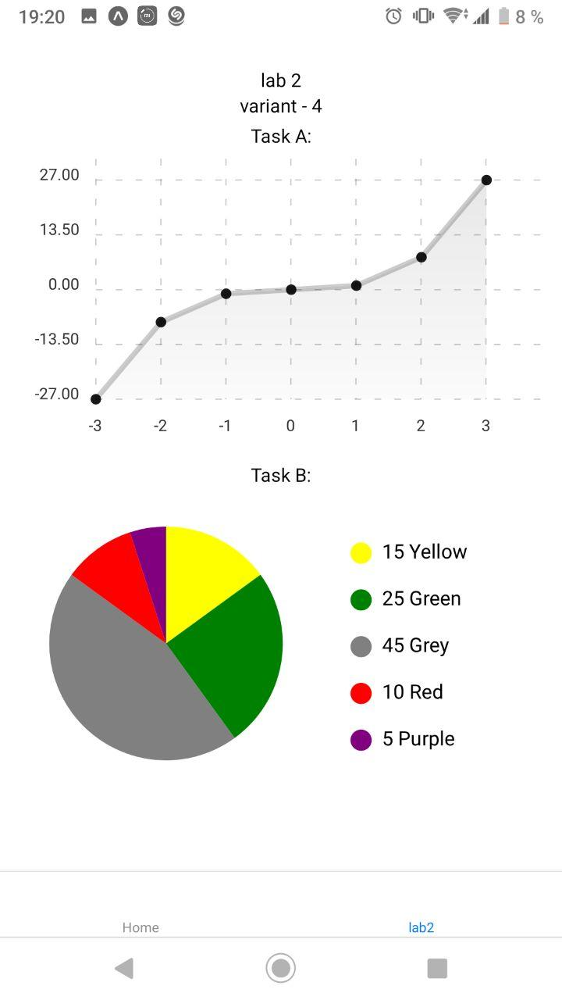

# lab 2 mobile app by Fedortsev

check my variant `(8127 % 6 + 1)` = 4

create new component for this laboratiry work

install new library - `npm install --save react-native-chart-kit` which can create chart and graphics

## create script in library react-native-chart-kit

create element `<LineChart>` and `<PieChart>` and put them their parameters like :

data, value, view parameters, % (in circle diagram)

example of output:

## create gitignore, commit and push to git
